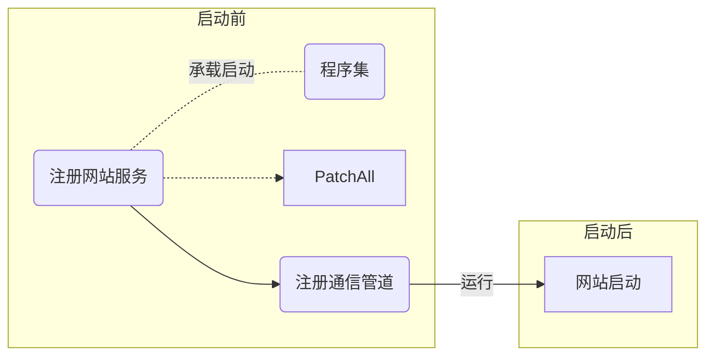
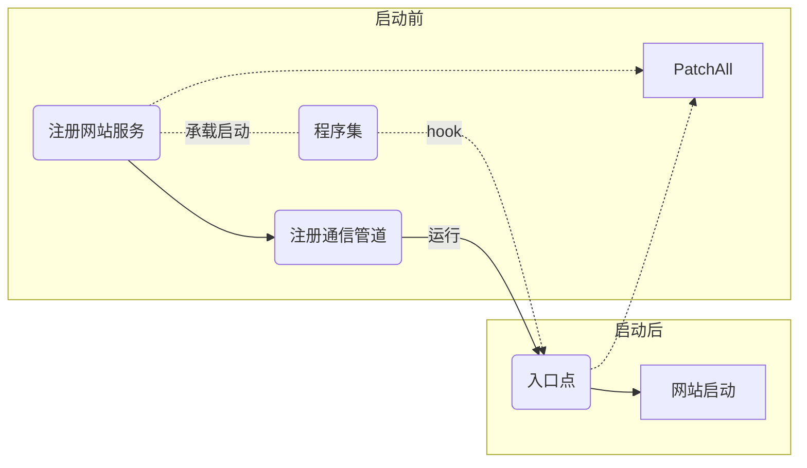

# .NET 笔记

## 参考资料

- [.NET CLR 注入](https://zhuanlan.zhihu.com/p/61464591)
- [ASP.NET Core管道](https://www.cnblogs.com/artech/p/asp-net-core-pipeline.html)
- [承载启动](https://docs.microsoft.com/zh-cn/aspnet/core/fundamentals/host/platform-specific-configuration?view=aspnetcore-3.1)
- [Harmony Github Wiki](https://github.com/pardeike/Harmony/wiki/Bootstrapping)
- [Asp.Net Core 生命周期](https://cloud.tencent.com/developer/article/1029834)

## hook方式

### ~~Easyhook~~

### harmony

- [x] 重载处理方式
  > 在注解中加入重载的参数类型表

## hook位置

### Mysql

命名空间：`MySql.Data.MySqlClient`
连接类：`MySqlConnection`
操作类：`MySqlCommand`
查询：`ExecuteReader()`
增删改：`ExecuteNonQuery()`
返回查询结果中第一行第一列的值：`ExecuteScalar()`

### SqlServer

命名空间：`System.Data.SqlClient`
操作类：`SqlConnection`

### Oracle

命名空间：`System.Data.OracleClient`
操作类：`OracleConnection`

### OLE DB

命名空间：`System.Data.OleDb`
操作类：`DleDbConnection`

## 承载启动

### 类库

- 项目引用DLL文件
- 添加环境变量`set ASPNETCORE_HOSTINGSTARTUPASSEMBLIES=$dll_name`
- *安装nuget包*
- ~~配置项目xml~~
  
  ```xml
  <ItemGroup>
    <Reference Include=".\\bin\\Debug\\netcoreapp<ver>\\$dll_name$.dll">
      <HintPath>.\bin\Debug\netcoreapp<ver>\$dll_name$.dll</HintPath>
      <SpecificVersion>False</SpecificVersion>
    </Reference>
  </ItemGroup>
  ```

  示例：

  ```xml
  <ItemGroup>
    <Reference Include=".\\bin\\Debug\\netcoreapp3.1\\AgentDemo.dll">
      <HintPath>.\bin\Debug\netcoreapp3.1\AgentDemo.dll</HintPath>
      <SpecificVersion>False</SpecificVersion>
    </Reference>
  </ItemGroup>

  ```

## 问题

通过承载启动方式的hook在网站启动前生效，网站启动后失效。



经过侵入型测试得知，在网站启动后调用一次`PatchAll`即可达到预期效果。

### 解决方案

#### 方案一

hook网站入口点，在入口处调用`PatchAll`。



#### 方案二

hook网站中一定会执行的方法，在第一次执行时调用`PatchAll`。

#### 测试点

|命名空间|类名|方法名|测试结果|备注|
|-|-|-|-|-|
|`Microsoft.AspNetCore.Mvc`|`HostingAbstractionsHostExtensions`|`Run()`|$\times$|hook成功，但没有达到预期效果，推测该入口的位置太靠前。|
|`Microsoft.AspNetCore.Mvc`|`Controller`|`View()`|$\times$|hook失败，具体原因未知。|
|`Microsoft.AspNetCore.Builder`|`EndpointRouteBuilderExtensions`|`MapGet()`|$\times$|找不到对应的程序集|

#### 临时解决方案

将`PatchAll`的时间延迟，起效。
