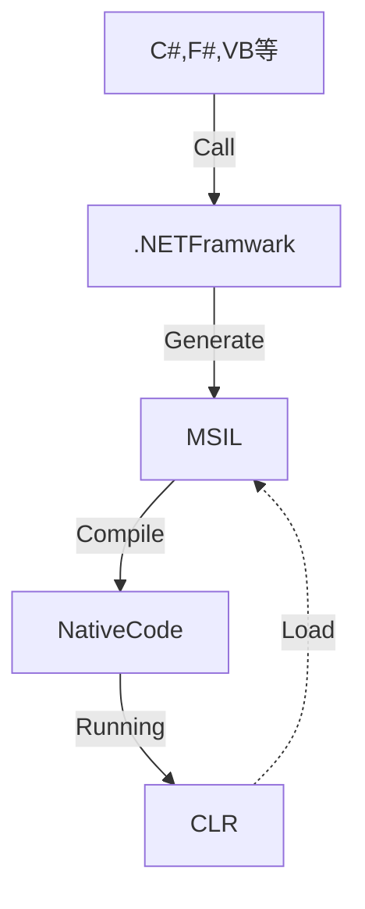

# .NET 学习笔记

## CLR注入方法学习

> 原文章：[.NET CLR注入方法探讨](https://zhuanlan.zhihu.com/p/61464591)

### CLR和托管代码(Manage Code)

.NET Framework 提供了一个称为CLR(Common Language Runtime)的运行时环境，.NET的程序都是在CLR中运行的。

### 中间语言(IL)

.NET编写的代码编译后为IL构成的二进制文件，类似jvm的字节码。
IL构成的二进制文件在运行时会交给CLR接管，并由CLR进行翻译(JIT)，生成可以直接运行的机器码后执行。
IL有时也称为通用中间语言(CIL)或Microsoft中间语言(MSIL)。

### 元数据(Metadata)和PE文件

元数据是描述程序的二进制信息，储存在PE文件或内存中。当将基于.NET编写的代码编译成PE文件时，元数据和IL代码将写入到PE文件中。
我们可以通过反编译来了解程序集或可执行文件中包含的Metadata和IL的秘密，打开[ILDasm](https://docs.microsoft.com/zh-cn/dotnet/framework/tools/ildasm-exe-il-disassembler)并加载实现准备的程序集，我们可以看到托管PE文件的相关内容：
.NET是基于面向对象的，所以元数据描述的主要目标就是面向对象的基本元素：类、类型、属性、方法、字段、参数、特性等，主要包括：
- 定义表，描述了源代码中定义的类型和成员信息，主要包括：TypeDef、MehodDef、FieldDef、ModuleDef、PropertyDef等。
- 引用表，描述了源代码中引用的类型和成员信息，引用元素可以是同一程序集的其他模块，也可以是不同程序集的模块，主要包括：AssemblyRef、TypeRef、ModuleRef、MethodsRef等。
- 指针表，使用指针表引用未知代码，主要包括：MethodPtr、FieldPtr、ParamPtr等。
- 堆，以stream的形式保存的信息堆，主要包括：#String、#Blob、#US、#GUIDe等。

.NET程序编写运行的流程为：

## hook方式探究

