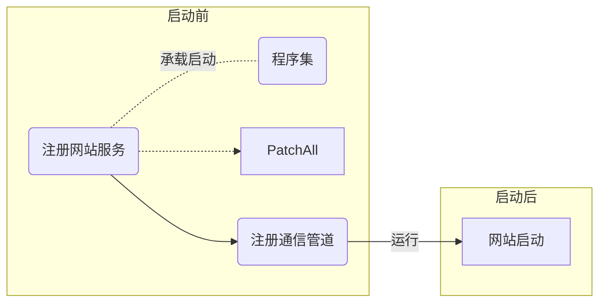
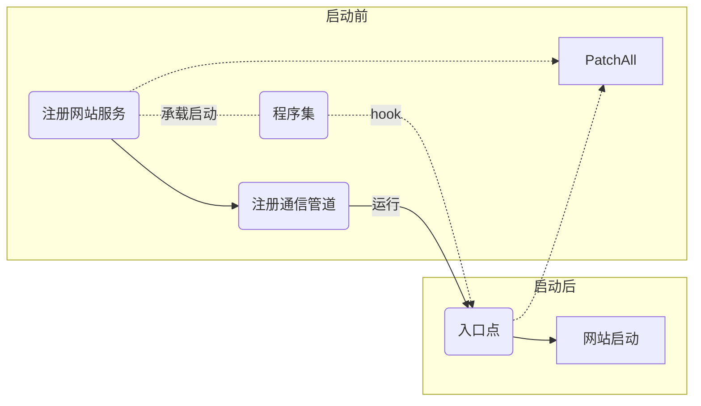

# 问题

通过承载启动方式的hook在网站启动前生效，网站启动后失效。

经过侵入型测试得知，在网站启动后调用一次`PatchAll`即可达到预期效果。

## 解决方案

### 方案一

hook网站入口点，在入口处调用`PatchAll`。

### 方案二

hook网站中一定会执行的方法，在第一次执行时调用`PatchAll`。

### 测试点

|命名空间|类名|方法名|测试结果|
|-|-|-|-|
|`Microsoft.AspNetCore.Mvc`|`HostingAbstractionsHostExtensions`|`Run()`|hook成功，但没有达到预期效果，推测该入口的位置太靠前。|
|`Microsoft.AspNetCore.Mvc`|`Controller`|`View()`|hook失败，具体原因未知。|
|`Microsoft.AspNetCore.Builder`|`EndpointRouteBuilderExtensions`|`MapGet()`|找不到对应的程序集|

### 临时解决方案

将`PatchAll`的时间延迟，起效。
