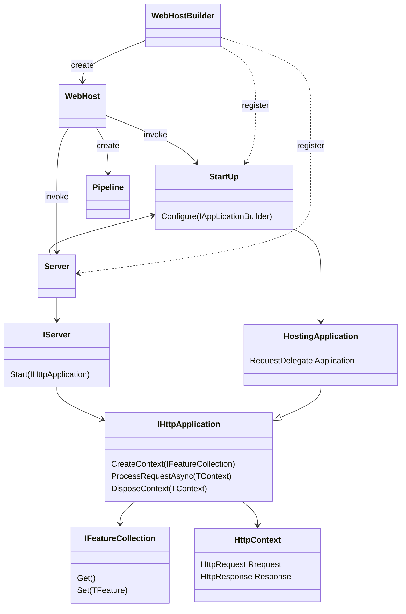

# HTTP研究

## 参考资料

- [ASP.NET Core管道](https://www.cnblogs.com/artech/p/asp-net-core-pipeline.html)
- [ASP.NET Core通信管道](https://blog.csdn.net/Cool2Feel/article/details/100514911)
- [基于工厂的中间件激活](https://docs.microsoft.com/zh-cn/aspnet/core/fundamentals/middleware/extensibility?view=aspnetcore-3.1)
- [动态添加管道/request repose处理](https://cloud.tencent.com/developer/article/1475831)

## 管道构成

- `WebHostBuilder`创建`WebHost`，`WebHost`创建管道
- 在`StartUp`中定制管道(中间件或者`HttpApplication`)，在`WebHostBuilder`中注册，在`WebHost`中调用
- `Server`同上
