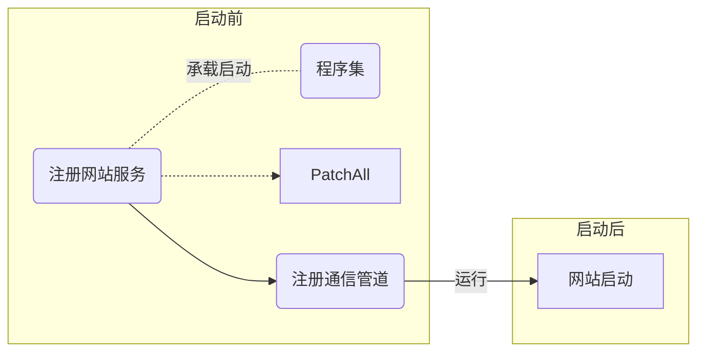
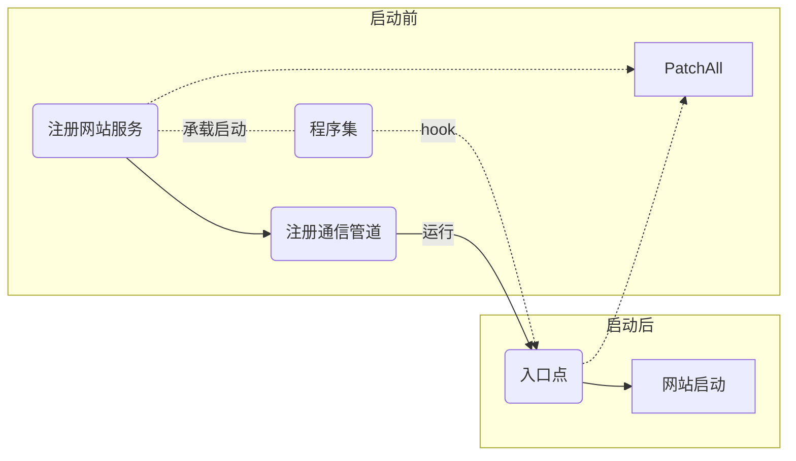

# 问题

通过承载启动方式的hook在网站启动前生效，网站启动后失效。



经过侵入型测试得知，在网站启动后调用一次`PatchAll`即可达到预期效果。

## 解决方案

### 方案一(未成功)

hook网站入口点，在入口处调用`PatchAll`。



#### 测试入口点

|命名空间|类名|方法名|测试结果|
|-|-|-|-|
|`Microsoft.AspNetCore.Mvc`|`HostingAbstractionsHostExtensions`|`Run()`|hook成功，但没有达到预期效果，推测该入口的位置太靠前。|
|`Microsoft.AspNetCore.Mvc`|`Controller`|`View()`|hook失败，具体原因未知。|
|`Microsoft.AspNetCore.Builder`|`EndpointRouteBuilderExtensions`|`MapGet()`|找不到对应的程序集|

### 方案二(未完全成功)

通过异步等待使`PatchAll`第二次的调用时间延迟。

```sequence
participant 网站
participant 插件
note left of 网站: 启动服务
网站->插件: 承载启动
插件->插件: 第一次patch
插件-->>网站: async await
note right of 插件: 异步等待
网站->网站: 启动网站
网站-->>插件: call
插件->插件: 第二次patch
```

在Debug项目中生效，Realase项目中无效。
