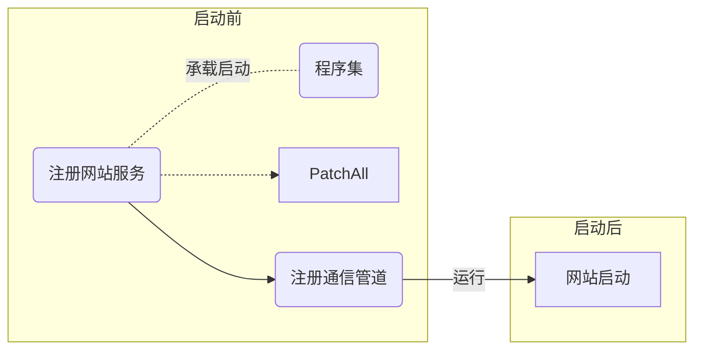
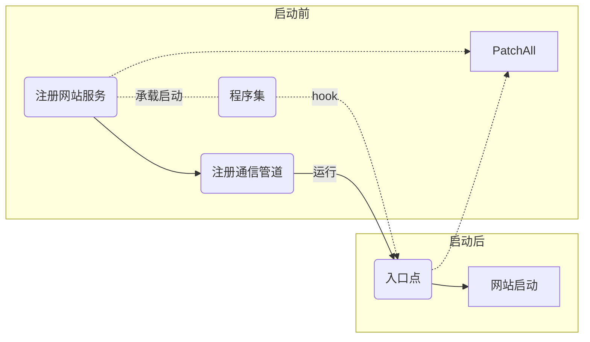

# 问题

通过承载启动方式的hook在网站启动前生效，网站启动后失效。



经过侵入型测试得知，在网站启动后调用一次`PatchAll`即可达到预期效果。

## 解决方案

### 方案一(未成功)

hook网站入口点，在入口处调用`PatchAll`。



#### 测试入口点

|命名空间|类名|方法名|测试结果|
|-|-|-|-|
|`Microsoft.AspNetCore.Mvc`|`HostingAbstractionsHostExtensions`|`Run()`|hook成功，但没有达到预期效果，推测该入口的位置太靠前。|
|`Microsoft.AspNetCore.Mvc`|`Controller`|`View()`|hook失败，具体原因未知。|
|`Microsoft.AspNetCore.Builder`|`EndpointRouteBuilderExtensions`|`MapGet()`|找不到对应的程序集|

### 方案二(未完全成功)

通过异步等待使`PatchAll`第二次的调用时间延迟。

```sequence
participant 网站
participant 插件
note left of 网站: 启动服务
网站->插件: 承载启动
插件->插件: 第一次patch
插件-->>网站: async await
note right of 插件: 异步等待
网站->网站: 启动网站
网站-->>插件: call
插件->插件: 第二次patch
```

在Debug项目中生效，Realase项目中无效。

### 阶段性研究

- 推测`release`失效原因在于`release`对编码进行了优化：
  - 测试方式：`release`去掉编码优化测试成功，`Debug`添加编码优化测试失败。
  - 查看两个版本中`Harmony`的输出日志，除了运行时间其他内容无差别。
  - 查看插件中`Debug`版本和`Release`版本的dll反编译后的源码。`Agent`端和`Web`端的主要差异是`Release`去掉了一些输出语句，次要差异是`Release`简化了一些不影响逻辑的代码，问题很有可能在`Harmony`项目中。
  - `Harmony`反汇编后的代码量较大，正在对比检查逻辑变更的位置。
  - `release`测试`String.Insert`成功，`MysqlCommand.ExecuteReader`失败，但两个测试程序几乎一样，致使测试结果不同的原因值得探究。
- 研究了下`skyapm-dotnet`的源码：
  - 他是通过扩展服务类注册了一个服务在承载启动中调用，照葫芦画瓢写了一个服务但没有见效。
  - 除了使用`IHostingStartup`还使用了`IHostedService`。
- 看了看承载启动的其他方式，其中**运行时存储**的加载机制和通过类库加载的差别比较大，但实现难度也比较大，如果类库加载的方式没什么进展可以试一试**运行时存储**的机制。

### **Release版本失效原因**

> 原因:编码优化后失效
> 反编译`MySql.Data.dll`查看源码得知`MySqlClient.ExecuteRead()`中调用的另一个重载`ExecuteReader(CommandBehavior)`，对后者进行hook成功。推测Release优化编码后直接调用后者，所以对前者hook失效。
