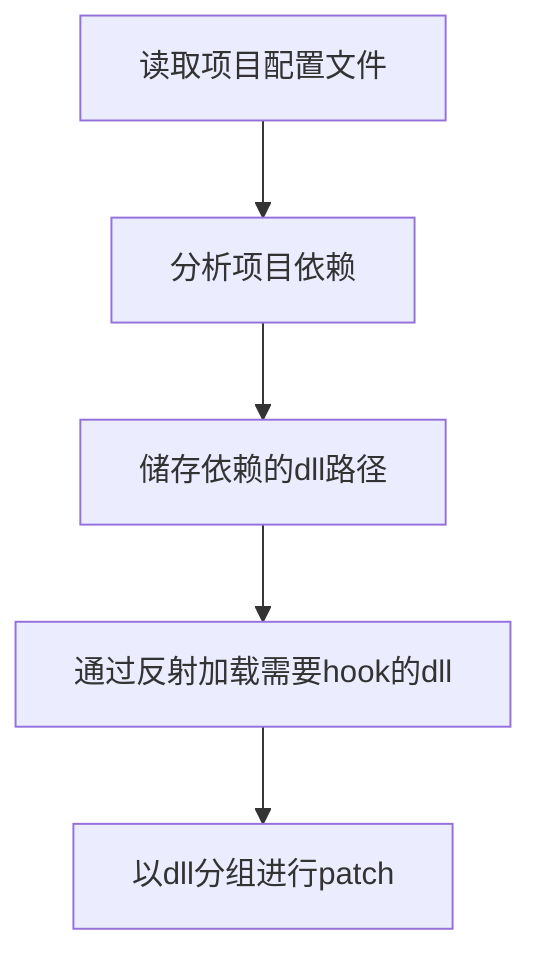

# 项目插件配置

## 参考资料

- [项目托管和部署](https://docs.microsoft.com/zh-cn/aspnet/core/host-and-deploy/?view=aspnetcore-3.1)
- [应用发布方式](https://docs.microsoft.com/zh-cn/dotnet/core/deploying/)
- [项目目录结构](https://docs.microsoft.com/zh-cn/aspnet/core/host-and-deploy/directory-structure?view=aspnetcore-3.1)

## 项目结构

### 依赖文件

`<ProjectName>.deps.json`

## 插件发布

|发布方式|可能产生的问题|
|-|-|
|独立发布|插件只patch自带的dll而不去patch网站使用的dll|
|依赖框架|插件去patch的dll网站必须要引用在项目中|

### 解决方案

独立发布如果测试不可行就采用依赖发布，
在项目启动时搜索项目依赖，
然后仅patch项目中引用的dll。
(参考`openrasp`的处理方式)

