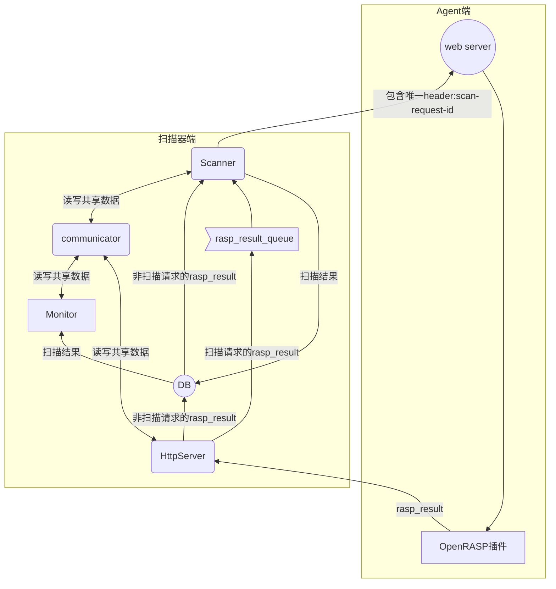

# IAST架构

## agent端

> 由一个单独的OpenRASP插件构成，用于提取http请求中hook点产生的信息，并通过HTTP协议以JSON形式发送至扫描器端。

## 扫描器端

> 一个独立运行的扫描工具，借助从OpenRASP插件部分获取的信息完成扫描任务。

```mermaid
graph BT
subgraph Agent端
openrasp[OpenRASP插件]
webserver((web server))
end
subgraph 扫描器端
httpserver(HttpServer)
db((DB))
monitor[Monitor]
raspresultqueue>rasp_result_queue]
scanner(Scanner)
communicator(communicator)
end
openrasp--rasp_result-->httpserver--非扫描请求的rasp_result-->db--扫描结果-->monitor<--读写共享数据-->communicator<--读写共享数据-->scanner--扫描结果-->db
db--非扫描请求的rasp_result-->scanner
httpserver--扫描请求的rasp_result-->raspresultqueue-->scanner
httpserver<--读写共享数据-->communicator
scanner--包含唯一header:scan-request-id-->webserver-->openrasp
```
