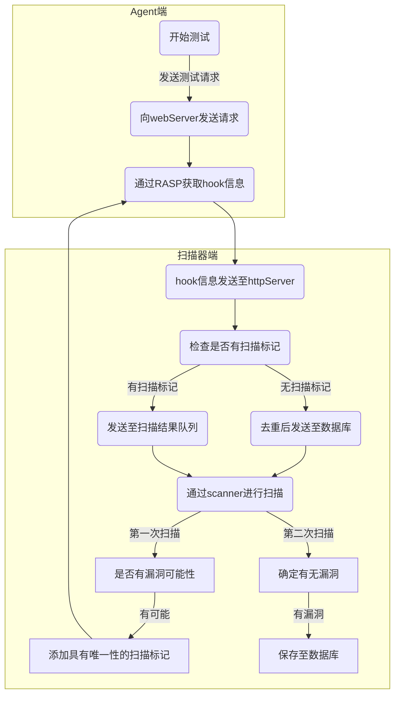

# IAST笔记

## 流程

```mermaid
graph TB
subgraph Agent端
start(开始测试)
send(向webServer发送请求)
hook(通过RASP获取hook信息)
end
subgraph 扫描器端
get(hook信息发送至httpServer)
check(检查是否有扫描标记)
queue(发送至扫描结果队列)
db(去重后发送至数据库)
scanner(通过scanner进行扫描)
start--发送测试请求-->send-->hook-->get-->check
check--有扫描标记-->queue
check--无扫描标记-->db
db-->scanner--第一次扫描-->是否有漏洞可能性--有可能-->添加具有唯一性的扫描标记-->hook
queue-->scanner--第二次扫描-->确定有无漏洞--有漏洞-->保存至数据库
end
```

## 问题

### 第一次扫描具体做了哪些处理

检测可能的漏洞类型，修改输入参数，提供攻击数据样本。
