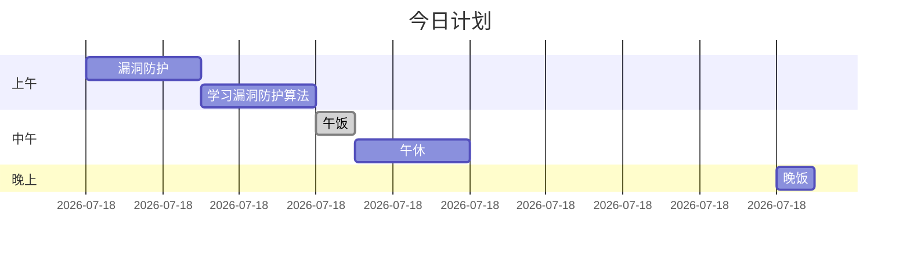

# 今日计划

```mermaid
gantt
dateFormat  HH:mm
title 今日计划
section 上午
漏洞防护: bug, 09:00, 90m
学习漏洞防护算法: after bug, 12:00
section 中午
午饭: done, lunch, 12:00, 30m
午休: after lunch, 14:00
section 下午
section 晚上
晚饭: dinner, 18:00, 30m
```
