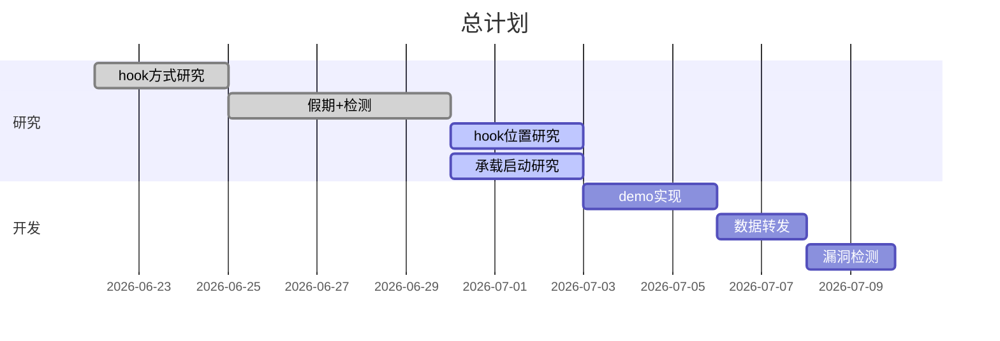

# 总计划

```mermaid
gantt
dateFormat MM-DD
title 总计划
section 研究
hook方式研究: done, hook_find, 06-22, 3d
假期+检测: done, holiday, after hook_find, 5d
hook位置研究: active, hook_location, after holiday, 3d
承载启动研究: active, startup ,after holiday, 3d
section 开发
demo实现: hook_impl, after startup, 3d
数据转发: data_send, after hook_impl, 2d
漏洞检测: bug_check, after data_send, 2d
```

## 今日计划

```mermaid
gantt
dateFormat  HH:mm
title 今日计划
hook位置: 09:00, 14:00
承载启动: 14:00, 18:00
hook位置: 18:00, 21:00
```
