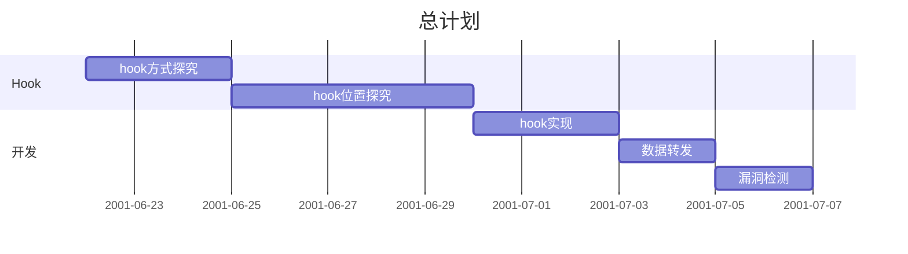

# 总计划

```mermaid
gantt
dateFormat MM-dd
title 总计划
section Hook
hook方式探究: hook_find, 06-22, 3d
hook位置探究: hook_location, after hook_find, 5d
section 开发
hook实现: hook_impl, after hook_location, 3d
数据转发: data_send, after hook_impl, 2d
漏洞检测: bug_check, after data_send, 2d
```

## 今日计划

```mermaid
gantt
dateFormat  HH:mm
title 今日计划
easyhook学习: 09:00, 21:00
```
