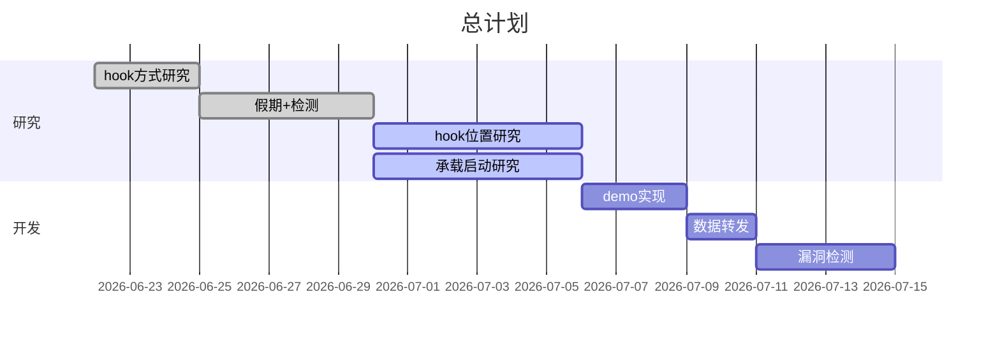

# 总计划

## 今日计划

```mermaid
gantt
dateFormat  HH:mm
title 今日计划
依赖查找: 09:00, 10:00
反射测试: 10:00, 16:00
dll路径: 16:00, 18:00
```

### 优先进行的计划

- [x] 反射加载dll测试
- [ ] 写一个DLL加载工具
  - [x] 读取项目依赖
  - [x] 派生HarmongPatchAttribute，减少代码冗余
  - [ ] **找到依赖对应dll类库的路径**
  - [ ] 设计一个舒适的框架
  - [x] 对一个方法只需要在一个类中进行配置(利用Attribute)
  - [ ] ParamType列表处理方式要好好想想

### 暂时搁置的计划

- [ ] Realase版本失效原因(插件启动流程 and 项目目录结构)
- [ ] 插件配置方式(Nuget包 or 插件独立发布 or 插件依赖框架)
- [ ] 线程上下文同步(`harmony`自带的`state`参数 or [通过C#实现](https://lindexi.gitee.io/post/C-dotnet-%E8%87%AA%E5%B7%B1%E5%AE%9E%E7%8E%B0%E4%B8%80%E4%B8%AA%E7%BA%BF%E7%A8%8B%E5%90%8C%E6%AD%A5%E4%B8%8A%E4%B8%8B%E6%96%87.html))
