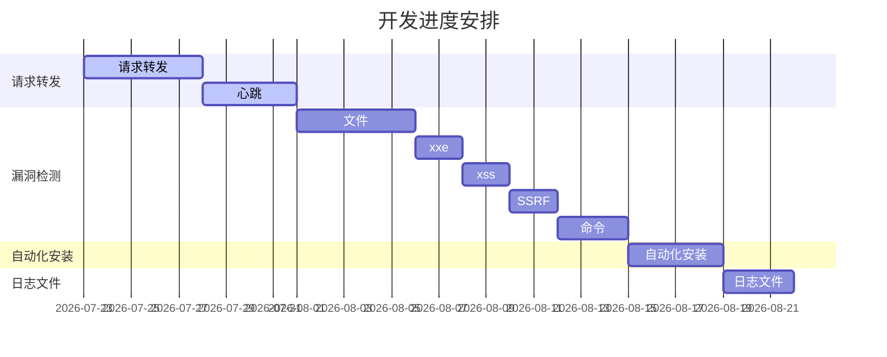

# 总计划

## 优先进行的计划

- [x] 实现请求转发
- [x] 心跳
- [x] 测试漏洞检测
- [ ] 开发漏洞检测
  - [x] Sql 注入
  - [ ] 命令注入
  - [x] 文件读取
  - [x] 文件写入
  - [ ] 文件上传
  - [x] XXE
  - [x] SSRF
  - [ ] XSS
- [ ] 自动化安装
- [x] 日志文件
- [x] 配置文件
