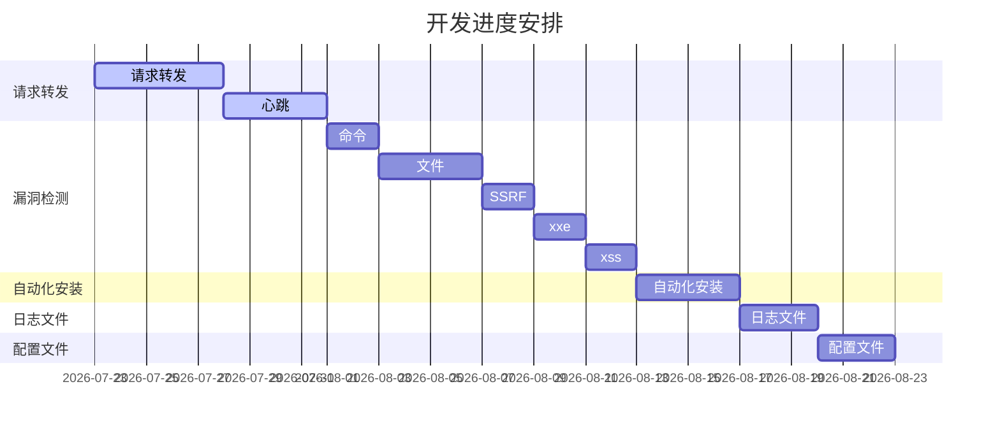

# 总计划

## 优先进行的计划

- [x] 实现请求转发
- [x] 心跳
- [x] 测试漏洞检测
- [ ] 开发漏洞检测
  - [ ] 命令注入
  - [ ] 文件相关
    - [x] 文件读取
    - [ ] 文件上传
  - [ ] SSRF
  - [ ] XXE
  - [ ] XSS
- [ ] 自动化安装
- [ ] 日志文件
- [ ] 配置文件

## 暂时搁置的计划

- [ ] 写一个 DLL 加载工具
  - [x] 读取项目依赖
  - [x] 派生 HarmongPatchAttribute，减少代码冗余
  - [x] **实现动态加载 DLL**
    - [x] 找到依赖对应 dll 类库的路径
    - [x] 解决 Patch 找不到 dll 路径后 Prefix 会报错的问题(修改 Harmony 源码)
    - [x] 参考`SkyApm`的做法
  - [x] 对一个方法只需要在一个类中进行配置(利用 Attribute)
  - [ ] ParamType 列表处理方式要好好想想
- [ ] **函数调用栈**
