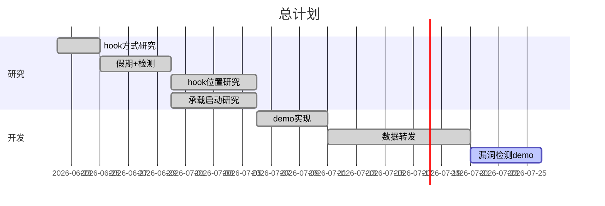

# 总计划

## 今日计划

```mermaid
gantt
dateFormat  HH:mm
title 今日计划
承载启动加载中间件: 09:00, 21:00
```

### 优先进行的计划

- [ ] 写一个 DLL 加载工具
  - [x] 读取项目依赖
  - [x] 派生 HarmongPatchAttribute，减少代码冗余
  - [x] **实现动态加载 DLL**
    - [x] 找到依赖对应 dll 类库的路径
    - [x] 解决 Patch 找不到 dll 路径后 Prefix 会报错的问题(修改 Harmony 源码)
    - [x] 参考`SkyApm`的做法
  - [x] 对一个方法只需要在一个类中进行配置(利用 Attribute)
  - [ ] ParamType 列表处理方式要好好想想
- [ ] 插件配置方式(Nuget 包 or 插件独立发布 or 插件依赖框架)
- [x] **函数调用栈**
  - [x] 可以打印，但也含有`Agent`端信息
  - [ ] 去除`Agent`端信息
  - [ ] 去除依赖`dll`的信息

### 暂时搁置的计划

- [ ] [发布后未加载程序集](https://docs.microsoft.com/zh-cn/aspnet/core/fundamentals/host/platform-specific-configuration?view=aspnetcore-3.1)
  - [ ] 加载顺序:`ConfigureAppConfiguration`还是`UseConfiguration`
  - [ ] 指定承载启动程序集设置环境变量`HostingStartupLibrary;HostingStartupPackage;StartupDiagnostics`
  - [ ] 承载启动激活选项
    - [ ] 运行时存储
    - [ ] NuGet 包
- [ ] 线程上下文同步(`harmony`自带的`state`参数 or [通过 C#实现](https://lindexi.gitee.io/post/C-dotnet-%E8%87%AA%E5%B7%B1%E5%AE%9E%E7%8E%B0%E4%B8%80%E4%B8%AA%E7%BA%BF%E7%A8%8B%E5%90%8C%E6%AD%A5%E4%B8%8A%E4%B8%8B%E6%96%87.html))
