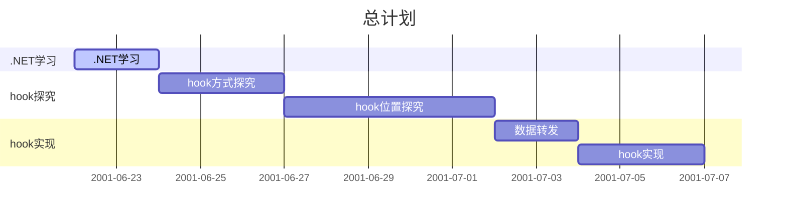

# 总计划

```mermaid
gantt
dateFormat MM-dd
title 总计划
section .NET学习
.NET学习: active, learn, 06-22, 2d
section hook探究
hook方式探究: hook_find, after learn, 3d
hook位置探究: hook_location, after hook_find, 5d
section hook实现
数据转发: data_send, after hook_location, 2d
hook实现: hook_impl, after data_send, 3d
```

## 今日计划

```mermaid
gantt
dateFormat  HH:mm
title 今日计划
section 上午
漏洞防护: bug, 09:00, 90m
学习漏洞防护算法: after bug, 12:00
section 中午
午饭: lunch, 12:00, 30m
午休: after lunch, 14:00
section 下午
agent端数据转发: 14:00, 17:00
.NET学习: 17:00, 18:00
section 晚上
晚饭: dinner, 18:00, 30m
.NET学习: after dinner, 21:00
```
