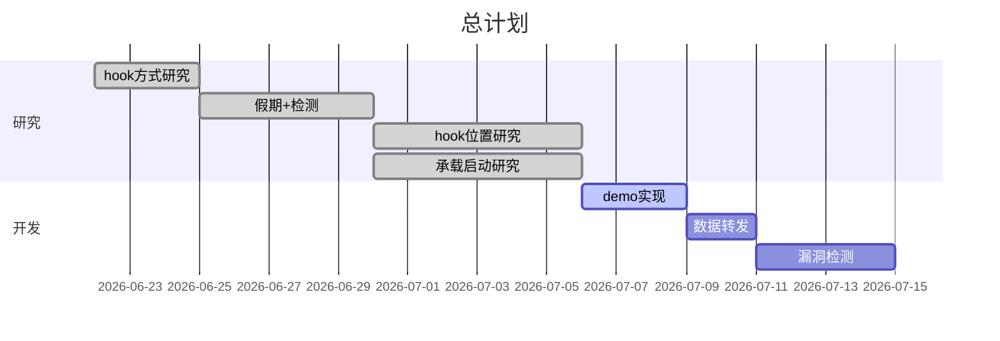

# 总计划

## 今日计划

```mermaid
gantt
dateFormat  HH:mm
title 今日计划
Patch的hook检查: 09:00,12:00
项目发布后启动插件: 12:00,21:00
```

### 优先进行的计划

- [ ] 写一个DLL加载工具
  - [x] 读取项目依赖
  - [x] 派生HarmongPatchAttribute，减少代码冗余
  - [x] **实现动态加载DLL**
    - [x] 找到依赖对应dll类库的路径
    - [x] 解决Patch找不到dll路径后Prefix会报错的问题(修改Harmony源码)
    - [x] 参考`SkyApm`的做法
  - [x] 对一个方法只需要在一个类中进行配置(利用Attribute)
  - [ ] ParamType列表处理方式要好好想想
- [ ] 插件配置方式(Nuget包 or 插件独立发布 or 插件依赖框架)
- [ ] **`Context`传递**
- [ ] **函数调用栈**

### 暂时搁置的计划

- [ ] [发布后未加载程序集](https://docs.microsoft.com/zh-cn/aspnet/core/fundamentals/host/platform-specific-configuration?view=aspnetcore-3.1)
  - [ ] 加载顺序:`ConfigureAppConfiguration`还是`UseConfiguration`
  - [ ] 指定承载启动程序集设置环境变量`HostingStartupLibrary;HostingStartupPackage;StartupDiagnostics`
  - [ ] 承载启动激活选项
    - [ ] 运行时存储
    - [ ] NuGet包
- [ ] 线程上下文同步(`harmony`自带的`state`参数 or [通过C#实现](https://lindexi.gitee.io/post/C-dotnet-%E8%87%AA%E5%B7%B1%E5%AE%9E%E7%8E%B0%E4%B8%80%E4%B8%AA%E7%BA%BF%E7%A8%8B%E5%90%8C%E6%AD%A5%E4%B8%8A%E4%B8%8B%E6%96%87.html))

### 完成的计划

- [x] 反射加载dll测试
- [x] **Release版本失效原因**
  - [x] 优化后失效
  - [x] 研究akyapm源码
  - [x] harmony反编译对比
  - [x] 继承IHostedService来承载启动
  > 反编译`MySql.Data.dll`查看源码得知`MySqlClient.ExecuteRead()`中调用的另一个重载`ExecuteReader(CommandBehavior)`，对后者进行hook成功。推测Release优化编码后直接调用后者，所以对前者hook失效。
